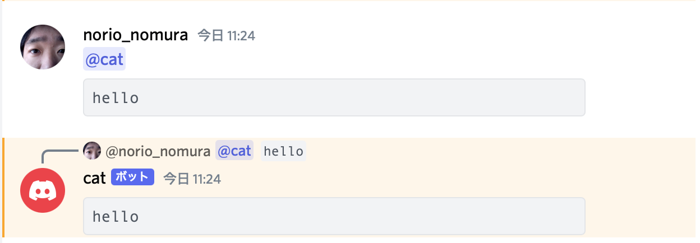

# CLI Discord Bot

Written in [Deno](https://deno.land) and deployed with Docker.

This is a generalized version of [SwiftCompilerDiscordappBot](https://github.com/norio-nomura/SwiftCompilerDiscordappBot) that can be used with various CLIs by configuration.

## How to use

1. Set Up Bot Account

   [Creating a discord bot & getting a token](https://github.com/reactiflux/discord-irc/wiki/Creating-a-discord-bot-&-getting-a-token)

   Required Permissions:

   - `CHANGE_NICKNAME` for update nickname
   - `READ_MESSAGE_HISTORY` and `VIEW_CHANNEL` for update replies on updating
     request from user

2. Invite Bot to Your Guild

   Open following URL with changing `<Client ID>` to your bot's Client ID:
   `https://discord.com/api/oauth2/authorize?client_id=<Client ID>&scope=bot&permissions=67174400`

3. Run bot on local host using `docker compose`
   ```terminal.sh-session
   export DISCORD_TOKEN="<discord token here>" # discord token, should be provided by `.env`
   docker compose up
   ```

4. Send mention to Bot

   - The bot will use the first code block as its standard input.
   - The bot will treat the mentioned lines as arguments for CLI command lines.
   - The bot will run the CLI for each command line and return them in replies.
   - When you edit/delete a mention, the bot will also edit/delete its replies.
   - The bot will reply in DM channel without mentions.

   

## Configuration

### Build time configuration

| Variable Name  | Description                                | default      |
| -------------- | ------------------------------------------ | ------------ |
| `DOCKER_IMAGE` | Docker image that provides swift on ubuntu | ubuntu:18.04 |

### Environment variables for run time configurations

| Variable Name              | Description                           | default            |
| -------------------------- | ------------------------------------- | ------------------ |
| `DISCORD_TOKEN`            | Discord Bot's token                   |                    |
| `DISCORD_NICKNAME`         | Discord Nickname                      | `TARGET_CLI` value |
| `DISCORD_PLAYING`          | status for "Playing"                  | `TARGET_CLI` value |
| `ENV_COMMAND`              | Env command launching Timeout command | `/usr/bin/env`     |
| `ENV_ARGS`                 | arguments for Env command             | `-i`               |
| `TARGET_CLI`               | target CLI                            | `cat`              |
| `TARGET_ARGS_TO_USE_STDIN` | arguments for CLI with input          |                    |
| `TARGET_DEFAULT_ARGS`      | arguments for CLI with no arguments   |                    |
| `TIMEOUT_COMMAND`          | Timeout command launching target CLI  | `timeout`          |
| `TIMEOUT_ARGS`             | arguments for timeout command         | `--signal=KILL 30` |

### Examples

#### swift 5.4 compiler bot:

```terminal.sh-session
export DISCORD_TOKEN="<discord token here>" # discord token, should be provided by `.env`
export DOCKER_IMAGE=swift:5.4               # docker image
export TARGET_CLI=swift                     # target cli
export TARGET_ARGS_TO_USE_STDIN=-           # swift requires "-" to use stdin as code
docker compose up
```

#### jq bot:

```terminal.sh-session
export DISCORD_TOKEN="<discord token here>" # discord token, should be provided by `.env`
export DOCKER_IMAGE=stedolan/jq             # docker image
export TARGET_CLI=jq                        # target cli
docker-compose up
```

## Author

Norio Nomura

## License

CLI Discord Bot is available under the MIT license. See the LICENSE file for
more info.
